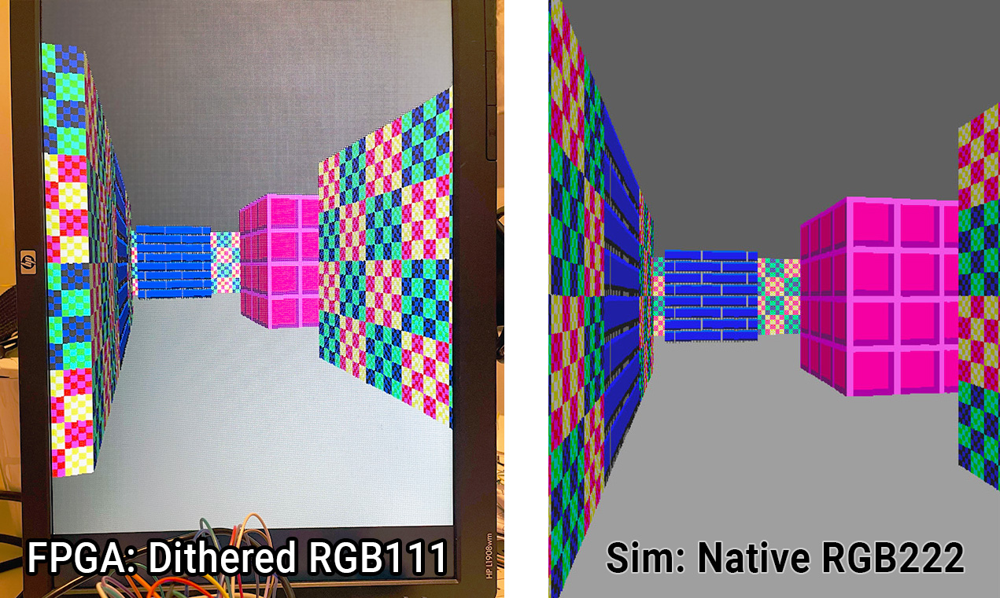

  

# raybox-zero for TT04 (Tiny Tapeout 04)

*   [Overview](#overview)
*   [Features](#features)
*   [Quick start](#quick-start)
*   [Write POV via SPI](#write-pov-via-spi)

## Overview

This is an attempt to create a Verilog HDL design implementing a sort of GPU that is a one-trick pony: It is a very simple ray caster demo (sort of like Wolf3D rendering) driving a VGA display without a framebuffer (i.e. by 'racing the beam'). It's inspired by Wolf3D and based on Lode's popular Raycasting tutorial (https://lodev.org/cgtutor/raycasting.html).

Here is the design running on an FPGA (in this case using dithered RGB111 output rather than the design's native RGB222) and a comparison with the same design running in a Verilator-based simulator:

The scene is rendered using a grid map of wall blocks, with basic texture mapping, and flat-coloured floor and ceiling. No doors or sprites in this version -- but maybe in TT05? In the TT04 130nm process this uses 4x2 tiles (about 0.16 square millimetres) at ~48% utilisation.

This repo wraps my [algofoogle/raybox-zero] repo as a submodule in [`src/raybox-zero`](src/raybox-zero/). Raybox-zero can be run on FPGAs (at least, it has a target included for the Altera Cyclone IV as found on a DE0-Nano board), but the purpose of *this* repo is to target silicon, i.e. to be made into an ASIC as part of the [TT04 shuttle](https://app.tinytapeout.com/shuttles/tt04) of [Tiny Tapeout](https://tinytapeout.com/).

For more information, including running this using software simulation, see the [raybox-zero repo][algofoogle/raybox-zero].

NOTE: It is intended that this design is normally driven by its SPI interface using a host controller of some kind, but for TT04 demo purposes it should display an interesting perspective on reset, and then there are two inputs which can be asserted to continuously increment "player X" and/or Y... a sort of demo mode.

## Features

*   640x480 VGA display at ~60Hz from 25MHz clock (25.175MHz ideal)
*   Portrait "FPS" orientation
*   RGB222 digital output with HSYNC and VSYNC
*   Hard-coded 16x16 grid map.
*   3 hard-coded wall textures, with "light-side" and "dark-side" variations
*   SPI interface to set 'POV'.
*   Debug overlay option for visualising POV register bits
*   2nd SPI interface ('SPI2') to set floor colour, ceiling colour, or floor 'leak'
*   'Demo mode' inputs
*   Registered and unregistered output options
*   Reset line with meaningful initial state
*   HBLANK and VBLANK outputs that can be used to drive interrupts

## Quick start

Attach a VGA connector's HSYNC and VSYNC to the chip's respective outputs, with (say) inline 100R resistors
just for protection. At minimum connect `red[1]`, `green[1]`, and `blue[1]` with inline 270R resistors,
or better yet use an R2R DAC for each colour output pair. Make sure the VGA GND is also connected, of course.

Pull up `reg` to select 'registered outputs'. Without this, you will get the unregistered versions, which
might be murky or have some timing issues -- I included this option for testing purposes.
In the actual ASIC version of this, I expect the registered outputs will be much cleaner, but we'll see.

Supply a 25MHz clock (or ideally 25.175MHz), and assert the `reset` signal, and you should get a
clockwise-90&deg;-rotated display of textured walls with dark grey ceiling (right-hand side)
and light grey floor (left-hand side).

Pull up the `debug` input and you should see little squares show up in the corner of the screen that represent
the current state of the POV registers -- more on this, later.

Pull up either or both of the `inc_px/py` inputs, and your view should start to drift along slowly.
This is 'demo mode'. Don't be alarmed when it goes through walls, or for the periods when you see half the
screen is just grey and the other half is flickering different colours -- this just means you're travelling
through the middle of a wall block.

## Write POV via SPI

Upon reset, the POV (Point of View) registers used for rendering are set to display an angled view of the design's small 16x16 grid map world. Because no framebuffer is used, rendering/animation can occur at the full frame rate. The most important thing you'd want to control is the POV.

The registers that store the POV can be updated anytime using the main SPI interface (`ss_n`, `sclk`, `mosi`). NOTE: SPI register values are double-buffered so they only get loaded and take effect at the very end of the visible frame (i.e. start of VBLANK). That means you can update them early, or multiple times per frame, or be in the process of updating them, and there will be no disruption of the current frame rendering; the next frame that gets rendered will only use whatever valid POV last had a completed write. It was designed this way so that you don't *have* to time anything... just write via this SPI interface anytime you want, as slowly as you want (or as quickly, up to probably 5MHz max).

The expectation is that some host controller decides what the POV should be (i.e. it implements the game/motion logic), and sends the POV via SPI to the chip. An MCU or low-spec CPU should be up to the task, but I've been bit-banging SPI with a Raspberry Pi Pico during testing.

NOTE: If either `inc_px` or `inc_py` are asserted, any pending SPI writes will be cancelled.

NOTE: Fixed-point values are used for the POV registers, where:
*   "UQ6.9" means an unsigned value that is 15 bits in total (6 integer bits, followed by 9 fractional bits, for a range of `[0.0, 64)` with 1/512 resolution); and
*   "SQ2.9" means a *signed* value of 11 bits in total (1 sign bit, 1 integer bit, 9 fractional bits, for a range of `[-2.0, 2.0)` with 1/512 resolution).

To write an updated POV via SPI, do the following, at no faster than a recommended 5MHz frequency:
1.  Start with `ss_n` deasserted (pulled high) and `sclk` low.
2.  Assert (i.e. pull low) `ss_n`.
3.  Present the first of 74 POV bits on `mosi`.
4.  Pulse `sclk` (i.e. raise and then lower it again).
5.  Present the next POV bit on `mosi` and pulse `sclk` again, and repeat until all 74 bits are done.
6.  Deassert (raise) `ss_n`.

The 74 bits to write are as follows, in order, MSB first:
1.  `playerX` position on the map, in UQ6.9 fixed-point format. NOTE: This offers greater range than the map itself. Values of 16.0 and above just wrap around.
2.  `playerY` position, UQ6.9
3.  `facingX` in SQ2.9 -- X component of the direction vector the player is facing, representing the middle 'ray' of the screen. A magnitude of 1.0 is normal. Larger values are more zoomed in (i.e. narrower FOV), and smaller values are the opposite.
4.  `facingY` in SQ2.9
5.  `vplaneX` in SQ2.9 -- X component of the viewplane vector. Typically the viewplane should be a vector that is perpendicular to the `facing` vector, and should have a magnitude of 0.5 for a 1:1 visual aspect ratio.
6.  `vplaneY` in SQ2.9.

Example POV register values:

| Register | Format | Value (binary)   | Value (decimal) |
|-|-|-:|-:|
| playerX  | UQ6.9  | `000110.100000000` |  5.5 |
| playerY  | UQ6.9  | `000100.100000000` |  4.5 |
| facingX  | SQ2.9  | `    00.000000000` |  0.0 |
| facingY  | SQ2.9  | `    01.000000000` |  1.0 |
| vplaneX  | SQ2.9  | `    11.100000000` | -0.5 |
| vplaneY  | SQ2.9  | `    00.000000000` |  0.0 |

To "rotate" the view, you can just rotate the `facingX/Y` and `vplaneX/Y` vectors, i.e. apply a simple
[sin/cos-based vector matrix multiplication](https://lodev.org/cgtutor/raycasting.html#:~:text=like%20zooming%20out%3A-,When%20the%20player%20rotates,-%2C%20the%20camera%20has) to them.
Note also that `vplane` can also just be derived from `facing`.

## Controlling other registers via SPI2

**TBC** for:
*   Ceiling colour: `0000` followed by 6 bits for colour in BBGGRR order.
*   Floor colour: `0001` followed by colour as above.
*   Floor leak: `0002` followed by 6 bits (value 0..63)

## Other things TBC

*   RGB222 colour palette
*   Reading the debug overlay
*   raybox-game.py bridge and PicoDeo
*   Images of hard-coded map and textures
*   Other inputs/outputs
*   Game/effects ideas

# News

## Version 1.0 is on the shuttle

The TT04 deadline closed on 2023-09-08 at 20:00 UTC. The [version tagged `1.0`](https://github.com/algofoogle/tt04-raybox-zero/releases/tag/1.0) was successfully [submitted](https://app.tinytapeout.com/projects/136), and will be included when the TT04 ASIC is manufactured. Here is a rendering of the GDS (using 4x2 TT04 tiles):

That last ~20 hours was a crazy hackathon, ending for me around 5:30am local time. I am very grateful to all the very supportive and complimentary people involved in the Open Source Silicon sphere, and especially Matt Venn ([@mattvenn](https://github.com/mattvenn)), Uri Shaked ([@urish](https://github.com/urish)) and the [Tiny Tapeout Discord community](https://discord.com/invite/qZHPrPsmt6).

A tip if you plan on doing something like this: At least 1 day beforehand, just find out how long it actually takes for the [GitHub Actions](https://github.com/algofoogle/tt04-raybox-zero/actions) to run (i.e. to build your final GDS and *all other supporting files*), then account for at least as long as that runtime towards the end, and be prepared for the fact that there will be a mad rush from everyone else before the hard deadline. This design can take about 45 minutes to harden via GHA, but I saw that some participants had designs that took about 3 hours! You don't want to be caught out waiting for that as the submission window closes.

# What is Tiny Tapeout?

TinyTapeout is an educational project that aims to make it easier and cheaper than ever to get your digital designs manufactured on a real chip!

Go to https://tinytapeout.com for instructions!

## Resources

- [FAQ](https://tinytapeout.com/faq/)
- [Digital design lessons](https://tinytapeout.com/digital_design/)
- [Learn how semiconductors work](https://tinytapeout.com/siliwiz/)
- [Join the community](https://discord.gg/rPK2nSjxy8)

[algofoogle/raybox-zero]: https://github.com/algofoogle/raybox-zero
