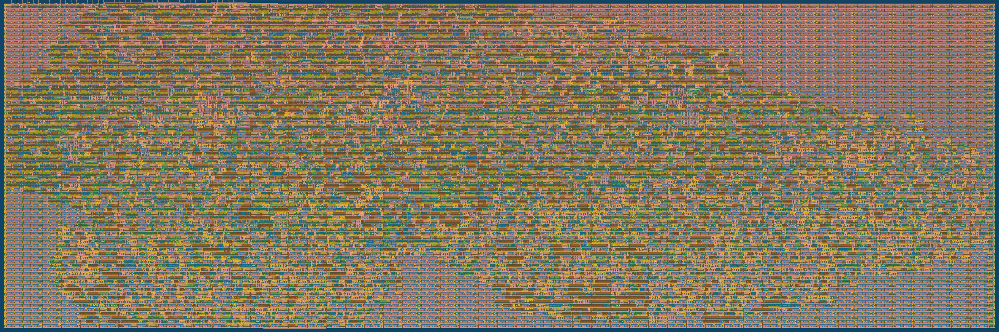

  

# raybox-zero for TT04 (Tiny Tapeout 04)

This is an attempt to create a Verilog HDL design implementing a sort of GPU that is a one-trick pony: It is a very  simple ray caster demo (sort of like Wolf3D rendering) driving a VGA display without a framebuffer (i.e. by 'racing the beam').

Here is the design running on an FPGA (sorry about the low-quality old monitor and dithered RGB111 output rather than the design's native RGB222) and a comparison with the same design running in a Verilator-based simulator:

This repo wraps my [algofoogle/raybox-zero] repo ([`src/raybox-zero`](src/raybox-zero/) is the git submodule). Raybox-zero can be run on FPGAs (at least, it has a target included for the Altera Cyclone IV as found on a DE0-Nano board), but the purpose of *this* repo is to target silicon, i.e. to be made into an ASIC as part of the [TT04 shuttle](https://app.tinytapeout.com/shuttles/tt04) of [Tiny Tapeout](https://tinytapeout.com/).

For more information, see the [raybox-zero repo][algofoogle/raybox-zero].

NOTE: It is intended that this design is normally driven by its SPI interface using a host controller of some kind, but for TT04 demo purposes it should display an interesting perspective on reset, and then there are two inputs which can be asserted to continuously increment "player X" and/or Y... a sort of demo mode.

# News

## Version 1.0 is on the shuttle

The TT04 deadline closed on 2023-09-08 at 20:00 UTC. The [version tagged `1.0`](https://github.com/algofoogle/tt04-raybox-zero/releases/tag/1.0) was successfully [submitted](https://app.tinytapeout.com/projects/136), and will be included when the TT04 ASIC is manufactured. Here is a rendering of the GDS (using 4x2 TT04 tiles):

That last ~20 hours was a crazy hackathon, ending for me around 5:30am local time. I am very grateful to all the very supportive and complimentary people involved in the Open Source Silicon sphere, and especially Matt Venn ([@mattvenn](https://github.com/mattvenn)), Uri Shaked ([@urish](https://github.com/urish)) and the [Tiny Tapeout Discord community](https://discord.com/invite/qZHPrPsmt6).

A tip if you plan on doing something like this: At least 1 day beforehand, just find out how long it actually takes for the [GitHub Actions](https://github.com/algofoogle/tt04-raybox-zero/actions) to run (i.e. to build your final GDS and *all other supporting files*), then account for at least as long as that runtime towards the end, and be prepared for the fact that there will be a mad rush from everyone else before the hard deadline. This design can take about 45 minutes to harden via GHA, but I saw that some participants had designs that took about 3 hours! You don't want to be caught out waiting for that as the submission window closes.

# What is Tiny Tapeout?

TinyTapeout is an educational project that aims to make it easier and cheaper than ever to get your digital designs manufactured on a real chip!

Go to https://tinytapeout.com for instructions!

## Resources

- [FAQ](https://tinytapeout.com/faq/)
- [Digital design lessons](https://tinytapeout.com/digital_design/)
- [Learn how semiconductors work](https://tinytapeout.com/siliwiz/)
- [Join the community](https://discord.gg/rPK2nSjxy8)

[algofoogle/raybox-zero]: https://github.com/algofoogle/raybox-zero
