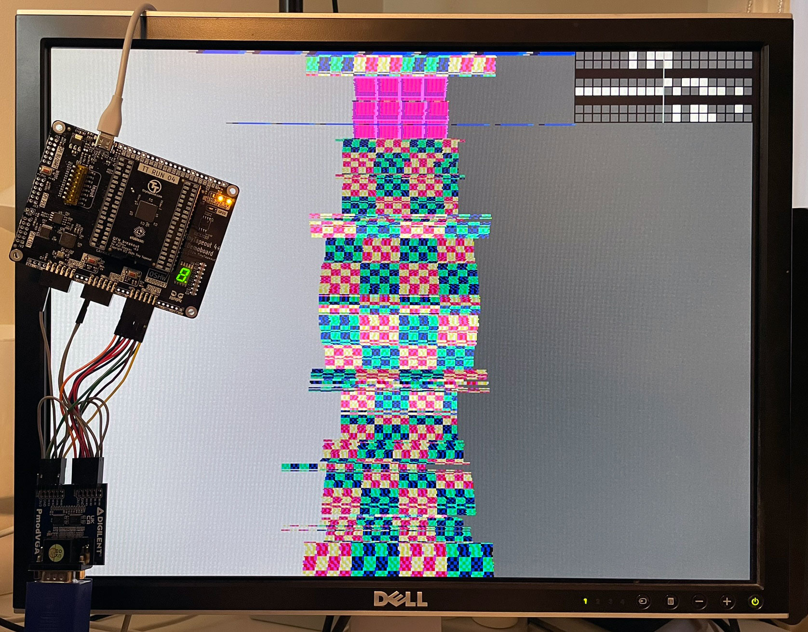
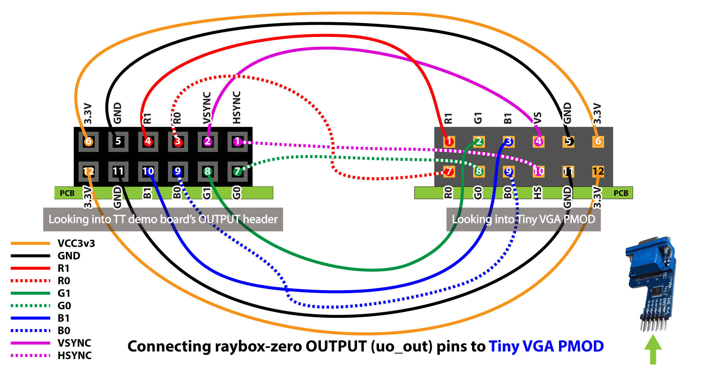
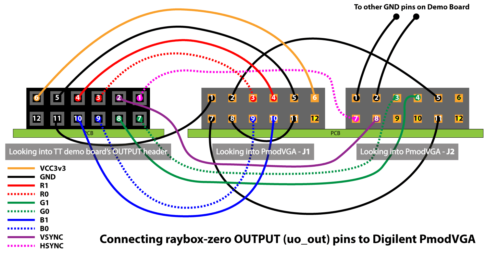
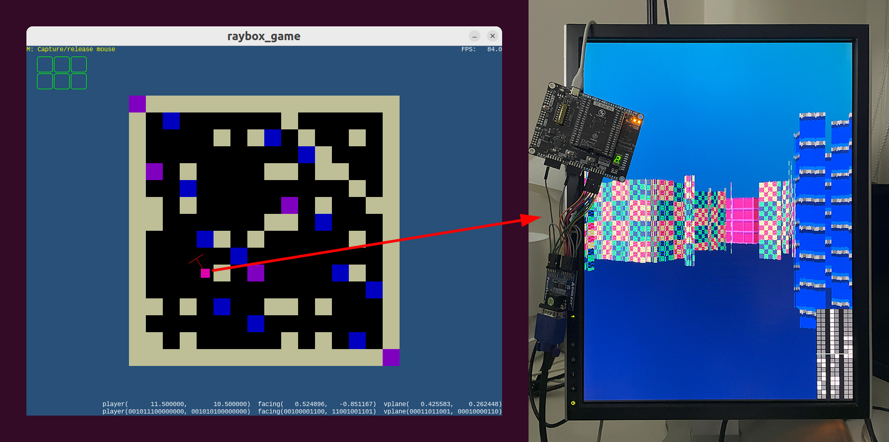

# Testing the t04-raybox-zero ASIC with the TT04 Demo Board

Here you will find information and MicroPython scripts that can be used to test the raybox-zero (TT04 edition) ASIC using the TT04 Demo board, e.g. via the [Tiny Tapeout Commander], and use it for a primitive game demo driven by your computer as the host.



Above is the default view of raybox-zero after a reset, with no other inputs.

> [!NOTE]
> The TT04 version of raybox-zero suffered a synthesis bug, as you can see in the image above. I've [documented this below](#tt04-synthesis-bug).

You can go to https://tinytapeout.com/start/tt04 for high-level instructions on getting started with the TT04 Demo Board.

## Here's my own quick-start guide...

First, wire up a VGA DAC, ideally one that provides at least RGB222 (raybox-zero uses exactly this much)...

### Wiring up a Tiny VGA PMOD

The [Tiny VGA PMOD](https://github.com/mole99/tiny-vga) is a great choice, but because the TT04 version of raybox-zero didn't yet match the Tiny VGA PMOD's direct pinout, **it needs to be wired up correctly**:




### Alternative: Wiring up a PmodVGA DAC

The [Digilent PmodVGA](https://digilent.com/reference/pmod/pmodvga/start) is what I have, so I wire it as follows (including pulling the extra unused colour bits low, as shown by the black wires):




### Getting raybox-zero running via TT Commander

1.  Plug in the TT04 Demo Board via USB.
2.  Go to the [Tiny Tapeout Commander]
3.  Click 'CONNECT TO BOARD'
4.  Select your board from the window that pops up and click 'Connect'
5.  On the 'CONFIG' tab, go to the 'Index' field and type in 33 and/or select 'Project' `raybox-zero (33)`
6.  Click 'SELECT'
7.  Set the clock speed preset to (say) 25.179 MHz and click 'SET'
8.  Go to the 'INTERACT' tab, tick 'ui_in' and make sure '3' is clicked on
9.  If necessary, click 'RESET'
10. Optionally turn on ui_in 4 and 5 to see the 'player sliding' animation

## Example test programs

> [!NOTE]
> Sometimes I see the RP2040 hang after several runs of sending lots of code; MicroPython memory leak (or expected behaviour)? This happens both in the TT Commander and when sending directly over USB serial. In my code this appears as a hang (in pyserial) where CTRL+C won't abort. My code detects a timeout but remains hung; you need to pull the USB cord.

### raybox_game.py

**You run this one on your host computer** to control the TT04 demo board without TT Commander. It's a very simple example of a game environment rendered on the raybox-zero TT04 ASIC: the host PC works out the game logic in response to keyboard (WASD motion keys) and mouse inputs, and offloads 3D world rendering to the TT04 demo board.



This is intended to be used with your monitor in "portrait mode" (i.e. rotated on its side):
*   It is best if you rotate it anti-clockwise, and ensure that `FLIPPED = False` in `raybox_game.py`
*   It also works if you rotate it clockwise, and ensure that `FLIPPED = True` in `raybox_game.py`

If you can't be bothered rotating your monitor, then I recommend setting `ROTATE_MOUSE = True` in `raybox_game.py`, in which case your mouse *up/down* motion (instead of left/right) has the illusion of "pitching" your view up and down as you fly through an obstacle course with the WASD keys.

> [!NOTE]
> This has been tested on Windows 11 (native) and in a Linux VM. For some VM setups, you'll need to make sure your VM "captures" your mouse so that my code can also capture the mouse; in VirtualBox this usually means turning 'Mouse Integration' *off* and then clicking inside the VM.

To set up and run the game demo:

1.  Requires Python 3.9 or above. I've been testing on 3.12.0.
2.  From within the `demoboard` dir, install Python packages: `pip install -r requirements.txt`
3.  Plug in your TT04 demo board via USB (unplug it first if necessary, to reset it).
4.  Run: `python3 ./raybox_game.py`

This will assume your TT04 board's RP2040 USB serial interface is the *last* device listed and attempt to connect to that. Assuming it succeeds, it will then:
*   Talk to MicroPython running on the RP2040 and try to bring it to a known state in "raw mode".
*   Select the `tt_um_algofoogle_raybox_zero` design, clock it at 25MHz, and reset it.
*   Send the contents of `raybox_peripheral.py` for MicroPython to load a basic interface we can send control signals to.
*   Present a UI on the host computer that shows the game map, while the raybox-zero VGA display should show your 3D view.

To control the 'game':

```
Main input functions:
- WASD keys move
- Mouse left/right motion rotates
- Left/right keyboard arrows rotate also (as do Q/E)
- Mouse left button 'shoots' (just a visual effect)

Numpad:
    9: sky_color++
    7: sky_color--
    3: floor_color++
    1: floor_color--
    +: zoom in map preview
    -: zoom out map preview

Mousewheel:
    Mousewheel scales the 'facing' vector, which basically
    has the effect of adjusting "FOV", otherwise described
    as telephoto/wide-angle zooming.

    Modifiers (can use any combo):
        - CTRL: x2 
        - SHIFT: x4
        - ALT: x8

    If you hold the '7' key on your keyboard main number row, the mousewheel action
    instead controls the 'leak' register (displacing floor height).

Other:
    ESC: Quit
    M or F12: Toggle mouse capture
    R: Reset game state
    `: Toggle vectors debug overlay
```

> [!NOTE]
> The raybox-zero hardware refreshes at a constant ~60fps frame rate (based on system clock), and can receive updates to the POV (point-of-view) and all other registers at least as fast as that. Various layers between the host PC and ASIC are currently a bottleneck, though, as I haven't yet optimised the code.
>
> I would next optimise: (a) using RP2040 PIO in MicroPython to replace SoftSPI; (b) sending raw data streams from the host to a MicroPython listener, instead of using the raw REPL; (c) using actual binary streams instead of bit-strings; (d) fixing the ugly game loop on the host side to be more like a normal frame-by-frame loop.


### tt04-raybox-zero-example.py

[`tt04-raybox-zero-example.py`](./tt04-raybox-zero-example.py) is a slightly older script I was working on that can be run directly in MicroPython to provide more of an API, if you want to muck about with the chip directly.

You can run this example by:

1.  Going to the 'REPL' tab in the Commander.
2.  Pressing CTRL+E to go into "paste" mode.
3.  Copy-pasting the contents of the file above into the REPL -- make sure you use Ctrl+**Shift**+V to paste.
4.  Pressing CTRL+D to then commit/execute the code.

This will show a demo/test loop that:
*   Shows one of 4 pre-defined views, changing very 1 second
*   Do a full revolution
*   Do a slow fine-grained "jiggle" back and forth, for analysis of the [synthesis bug](#tt04-synthesis-bug).

If you like, you can press CTRL+C to interrupt the code, then issue your own updates via the `reg` and `pov` objects, for example:

*   Put the player at a point on the map and with a 45-degree rotation:
    ```py
    pov.angular_pov(
        7.0, 9.5,               # Position
        45.0 * math.pi / 180.0  # Rotation in radians
    )
    ```
*   Set the floor colour to dark red by doing: `reg.floor(0b_00_00_01)` (bit pairs are Bb_Gg_Rr).
*   Set the sky colour to 'buff' by doing: `reg.sky(0b_01_10_11)`
*   Set the 'leak' value (floor displacement) by doing: `reg.floor(17)` (range is 0..63)


## TT04 synthesis bug

The TT04 version of raybox-zero suffered a synthesis bug, which was evidently caused by a flawed optimisation step inside the version of OpenLane used by Tiny Tapeout 4 at the time.

*   This leads to calculation errors that I think stem from a big multipler chain inside my reciprocal module approximator.
*   Since that module is used for lots of things (wall distance tracing, wall height calculation, texture scaling), the display has lots of glitches, but it's still possible to work out what the view is meant to be.
*   The reasons we're confident this is a synthesis bug are:
    *   RTL simulation and running on an FPGA don't show the issue, but gate-level simulation seems to recreate the bug perfectly.
    *   Whether running the silicon at 3MHz, 24MHz, or 31.5MHz, the visual artefacts appear to be exactly the same (so not affected by timing).
*   The problem seems to have gone away in some future version of OpenLane (i.e. I don't see the same problem in 3 more recent gate-level simulations I've done), but to be honest I've not checked *exactly* the same raybox-zero code version in those newer OpenLane versions, so I need to check that more carefully at some point.


[Tiny Tapeout Commander]: https://commander.tinytapeout.com/

